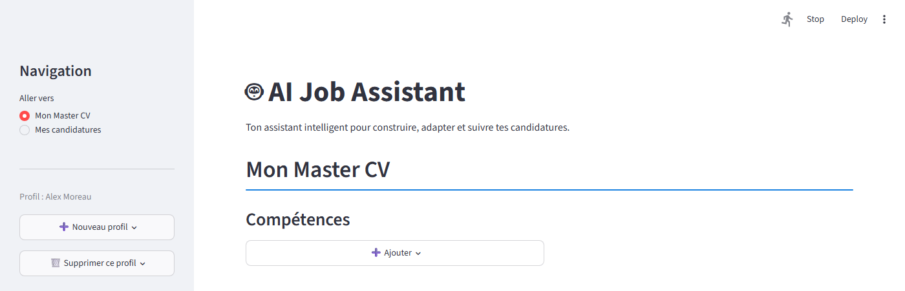
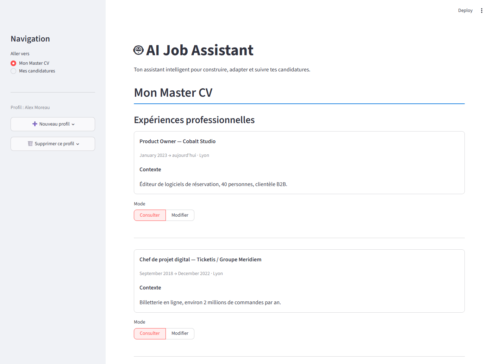
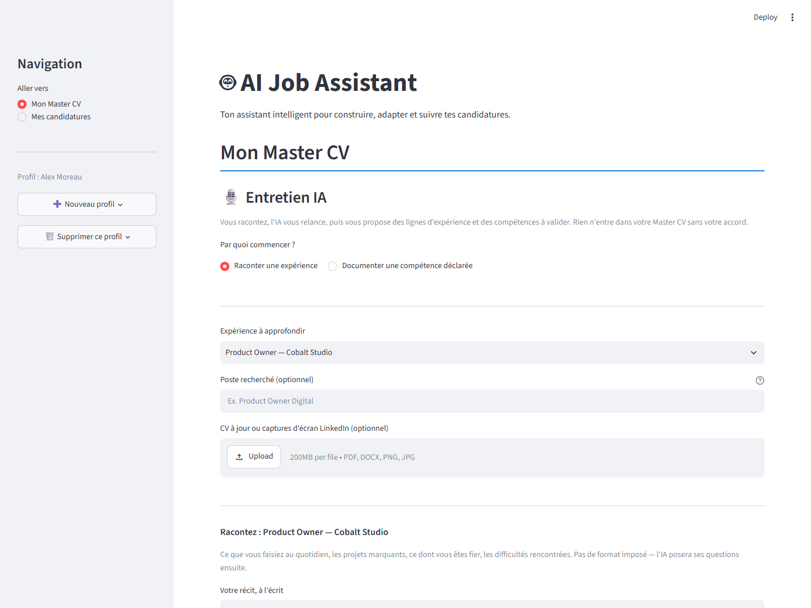

# AI Job Assistant

**Un assistant de candidature qui refuse de vous flatter.**

La plupart des outils de CV assistés par IA optimisent la formulation. Celui-ci part d'un
problème différent : sur un CV généré, **rien ne doit être affirmé que le candidat ne
puisse démontrer.** Tout le reste — le score, la génération, l'entretien — découle de cette
contrainte.

Projet personnel, construit en août-septembre 2026. Python, Streamlit, SQLAlchemy, Gemini.

---

## Le principe

Le cœur du produit est un **Master CV** : tout ce que le candidat a réellement fait, chaque
affirmation rattachée à une preuve datée.

Face à une annonce, chaque compétence demandée reçoit l'un de quatre statuts :

| statut | signification | peut figurer sur un CV généré |
|---|---|---|
| **prouvée** | déclarée **et** soutenue par une preuve du parcours | oui |
| **déclarée** | affirmée par le candidat, sans preuve | non |
| **déduite** | non déclarée, déduite du parcours | non, signalée comme piste |
| **manquante** | absente | non |

Cette distinction est la décision fondatrice du projet
([`c7ea97b`](../../commit/c7ea97b)). Sans elle, le générateur aurait affiché comme acquises
des compétences que rien ne démontre — ce qui est précisément ce que le candidat paierait
en entretien.


L'écran d'analyse ne donne pas qu'un score. Il isole **les conditions posées par l'annonce et
non couvertes** — le seul résultat sur lequel un candidat peut agir — et justifie chaque
statut, ligne par ligne.

---

## Comment la contrainte est tenue

Une consigne dans un prompt est une intention, pas une garantie. Les garde-fous du projet
sont donc **déterministes** et vérifiables ligne à ligne :

- **Chaque ligne d'un CV généré porte l'identifiant de sa preuve.** La preuve doit exister
  et appartenir au candidat.
- **Aucun chiffre ne peut apparaître s'il n'est pas dans la preuve d'origine.** Le
  validateur compare les nombres, en tenant compte des écritures équivalentes
  (« 100 k€ » et « 100 000 € » sont le même nombre).
- **La contrainte d'une page est vérifiée en rendant le PDF et en comptant ses pages**,
  pas en demandant au modèle d'estimer. L'élagage **retire** des éléments dans un ordre de
  priorité explicite ; il ne réécrit ni ne résume jamais — un CV raccourci reste
  exactement aussi vrai que le CV complet.
- **Le niveau d'exigence est lu dans le texte de l'annonce, pas proposé par l'IA.** Deux
  fois le même texte donnent deux fois le même classement, et un test le verrouille.
- **Une preuve doit être un fait situé** — un chiffre, un rythme, ou le nom propre d'un
  projet, d'un outil, d'une entreprise. À défaut, la ligne est décochée par défaut, jamais
  refusée.
- **Le validateur de CV est sans IA, délibérément.** Faire vérifier une IA par une autre
  remplacerait une garantie par une probabilité.
- **Chaque génération laisse une trace** : expériences, preuves et compétences retenues,
  compétences écartées **avec leur motif**, contrôle passé ou non.

---

## Ce que fait l'application

- **Master CV** — profil, expériences, compétences, formation, certifications.
- **Entretien assisté** — l'IA pose des questions ciblées, à l'écrit ou à l'oral, pour
  transformer un souvenir en preuve exploitable. Deux entrées : raconter une expérience,
  ou documenter une compétence déclarée sans preuve.
- **Analyse d'annonce** — extraction des exigences, niveau lu dans le texte
  (*essentielle / souhaitée / mention*), score, et surtout **la liste des conditions non
  couvertes**, qui est le seul résultat vraiment actionnable.
- **Génération de CV et de lettre** — déterministe ou rédigée par Gemini à partir d'une
  fiche de faits, avec repli automatique sur la version déterministe. Export DOCX et PDF.
- **Référentiel de compétences** — 13 476 entrées issues d'ESCO, enrichi par les annonces
  analysées : l'IA propose une entrée, l'utilisateur valide, et chaque décision de tri est
  réversible.
- **Suivi de candidatures** et mémoire de marché.

### Aperçu







> Ces captures utilisent un **profil de démonstration entièrement fictif** (Alex Moreau),
> construit pour que l'analyse produise les quatre statuts sur un même écran.

---

## Journal de décisions

**[`docs/journal-de-decisions.md`](docs/journal-de-decisions.md)** — huit décisions
structurantes, chacune avec son problème, sa mesure, son arbitrage et son résultat.

Quelques-unes, pour donner le ton :

- **Mon moteur ne marchait que pour moi.** Le vocabulaire d'un seul métier était codé en
  dur à quatre endroits ; 13 464 compétences sur 13 476 ne pouvaient jamais être déduites.
  Trouvé en fabriquant un profil d'infirmière et en le passant dans le moteur.
- **Retirer l'IA de la fonction qu'elle remplissait.** Deux captures de la même offre,
  identiques aux bandeaux de navigation près, obtenaient 34,6 et 44,5. Un score qui bouge
  de dix points sur le même texte n'aide à décider de rien.
- **Le modèle a ignoré la consigne.** La règle qui compte vraiment ne peut pas vivre dans
  un prompt.
- **Une mesure qui se compare à elle-même ne mesure rien.** Le jeu d'évaluation était
  pré-rempli avec la sortie du moteur ; le script l'exclut et dit pourquoi.

Le cadrage, la dette technique connue et la feuille de route sont dans
[`docs/cadrage_et_feuille_de_route.md`](docs/cadrage_et_feuille_de_route.md).

---

## Ce que ce projet ne fait pas

- **« Prouvé » signifie auto-déclaré et situé, pas vérifié.** Le contrôle vérifie qu'une
  affirmation porte un chiffre ou un nom propre — sa forme, pas sa véracité. Le produit
  rend les affirmations *falsifiables* ; il ne les vérifie pas.
- Le harnais d'évaluation existe et est testé, mais **n'a jamais été alimenté** : aucun cas
  relu par un humain. Les chiffres cités sont des mesures avant/après sur un corpus réel de
  treize annonces, pas des taux de précision validés.
- **Français uniquement.** Pas d'authentification : le sélecteur de profil cloisonne les
  données mais ne protège de personne ayant accès au fichier de base.
- Un seul utilisateur réel à ce jour.

La liste complète est en fin de journal de décisions, et la dette connue en section 6 du
cadrage. *Une dette écrite est une décision ; une dette tue est un piège.*

---

## Pile technique

| | |
|---|---|
| Langage | Python 3.14 |
| Interface | Streamlit |
| Données | SQLite + SQLAlchemy, migrations Alembic |
| LLM | Gemini (`google-genai`) |
| Recherche sémantique | `sentence-transformers`, modèle `paraphrase-multilingual-MiniLM-L12-v2` |
| Documents | `reportlab` (PDF), `python-docx` (DOCX), `pypdf`, `trafilatura` |
| Tests | pytest — **571 tests** |

74 modules applicatifs, 42 fichiers de test.

---

## Installation

```bash
python -m venv .venv
source .venv/bin/activate          # Windows : .venv\Scripts\activate
pip install -r requirements.txt
```

Créer un fichier `.env` à la racine :

```
GEMINI_API_KEY=votre_cle
```

L'application démarre sans clé : la génération assistée et l'entretien sont alors
indisponibles, le reste fonctionne. Elle démarre également sans
`sentence-transformers` — la déduction de compétences est alors désactivée.

Créer le schéma, amorcer le référentiel, puis lancer :

```bash
python -m database.init_db              # crée les 15 tables
alembic stamp head                      # aligne l'historique des migrations
python -m database.seed_skill_catalog   # 46 compétences de départ
streamlit run app.py
```

> `alembic stamp head` et non `upgrade head` : les migrations de ce dépôt sont
> **prospectives** — écrites sur un schéma déjà créé, elles ne rejouent pas une
> installation depuis zéro. Le schéma vient de `create_all`, Alembic prend le relais pour
> tout ce qui suit. `alembic check` confirme l'absence de dérive.

L'application s'ouvre sur une invitation à créer un profil. Le référentiel ESCO complet
(13 476 entrées) s'importe ensuite depuis l'onglet **Référentiel**.

### Tests

```bash
pytest
```

---

## Attribution

**Référentiel de compétences** — [ESCO](https://esco.ec.europa.eu/) v1.2.1, Commission
européenne, [CC BY 4.0](https://creativecommons.org/licenses/by/4.0/). L'attribution est
également affichée dans l'application.

**Développement assisté par IA** — le code est co-écrit avec Claude ; les commits le
portent explicitement (`Co-Authored-By`). Le travail de cadrage, de mesure et d'arbitrage
est documenté dans le journal de décisions — dont trois entrées consistent à **retirer**
une fonction que l'IA remplissait, après l'avoir mesurée.
